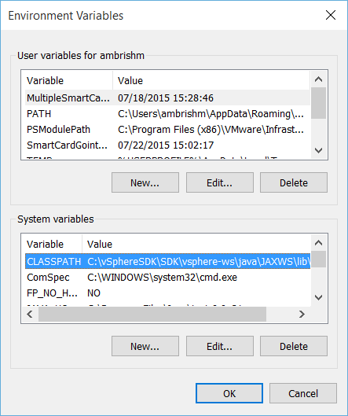
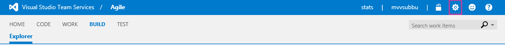
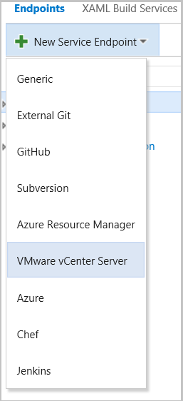
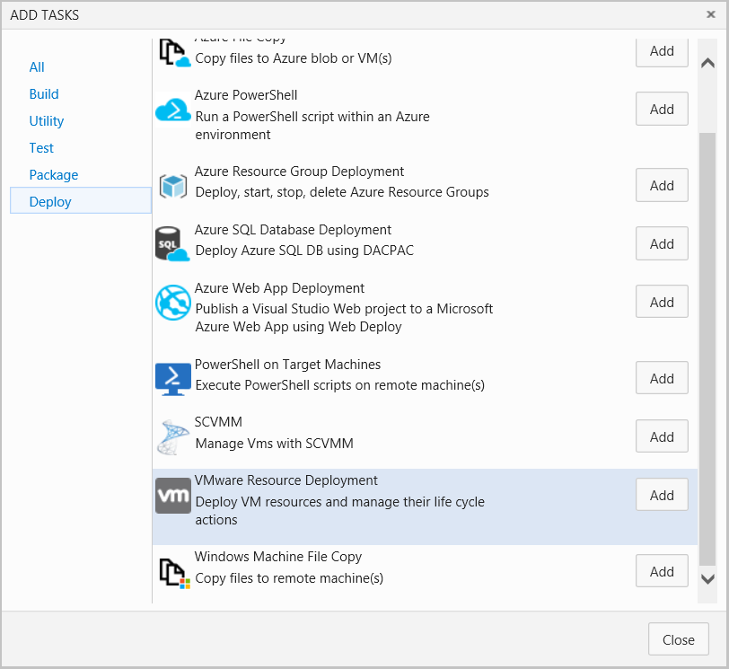
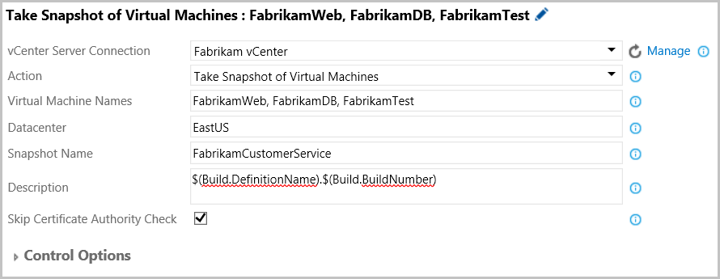
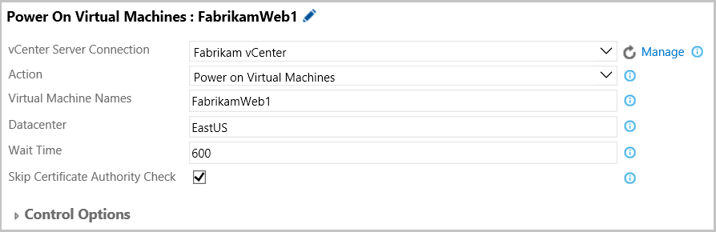
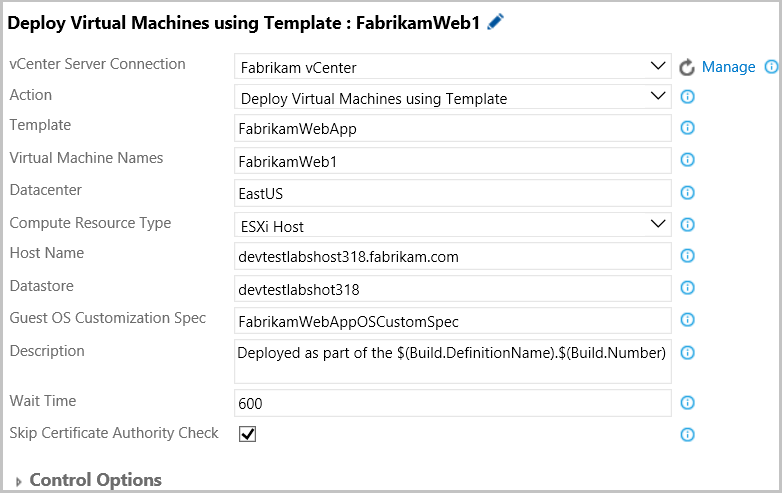
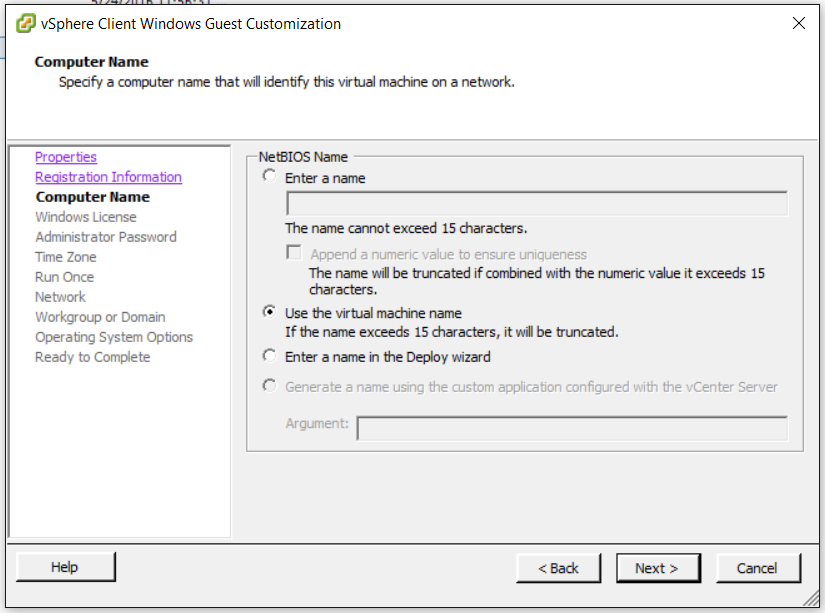

# **VMware Resource Deployment**

Connect to a VMware vCenter Server™ from Visual Studio Team Services or Team Foundation Server to provision, start, stop, or snapshot virtual machines. Following are the available actions.

 - Deploy virtual machines using template and Delete virtual machines.
 - Power-On, Power-Off, and Shutdown.
 - Take snapshot, Revert snapshot, and Delete snapshot of virtual machines.

## **Usage**

The extension installs the following components:

 - A service endpoint for connecting to the vCenter Server.
 - A VMware Resource Deployment task, to deploy virtual machines, and to perform actions on them.

Follow the steps given below to setup the extension and to use it to deploy resources in VMWare.  

### **Setting up a Windows Agent with vSphere Management SDK**

The extension uses the VMware vSphere® Management SDK, to call VMware API functions, to access vSphere Web services. Install and configure the SDK on the automation agent's machine as described below:

 1. Download and install the latest version of JRE™ or Java™ Runtime Environment from the [website](http://aka.ms/downloadjre).
 2. Create a directory for the vSphere Management SDK, like C:\vSphereSDK. Do not use spaces in the directory names to avoid issues with some of the included SDK batch and script files.
 3. Download the [vSphere 6.0 Management SDK](http://aka.ms/vspheresdk). Login with existing credentials or register on the website to download the SDK.
 4. Unpack the vSphere Management SDK in the C:\vSphereSDK directory.
 5. Add the precompiled VMware JAVA SDK file, vim25.jar, to the machine's CLASSPATH environment variable - C:\vSphereSDK\SDK\vsphere-ws\java\JAXWS\lib\vim25.jar.

 

### **Setting up a xPlat Agent with vSphere Management SDK**

  1.	Refer to setup instructions for installing and configuring an agent from [here](https://www.npmjs.com/package/vsoagent-installer)
  2.	Install JRE 8 by following below steps
    ```bash
        sudo add-apt-repository ppa:openjdk-r/ppa
        sudo apt-get update
        sudo apt-get install openjdk-8-jre -y
     ```
  3. Download the [vSphere 6.0 Management SDK](http://aka.ms/vspheresdk). Login with existing credentials or register on the website to download the SDK.
  4. Unpack and place vim25.jar from the vSphere Management SDK to a directory of your choice. For example, ~/vspheresdk
  5. Update the CLASSPATH to include /<pathtodirectory>/vpsheresdk/vim25.jar

### **Create a vCenter Server Service endpoint**

Visual Studio Team Services or Team Foundation Server requires a service connection to a vCenter Server to deploy virtual machines.  

   1. Open the **Services** tab in your Visual Studio Team Services or Team Foundations Server **Control Panel**.

 

   2. From the **New Service Endpoint** list, select **VMware vCenter**.

 

   3. In the **Add New VMware vCenter Server Connection** pop-up dialog, provide the required details to connect to the vCenter Server:
     * Provide a user friendly name for the service endpoint in the **Connection Name** like **Fabrikam vCenter**.
     * Enter the **vCenter Server URL**, like **https://devtestlab325.fabrikam.com/**. Note that only **HTTPS** connections are supported.
     * Enter a **Username** and **Password** that has the required access to the vCenter Server. Press **OK** to create the connection.

 

### **Using VMware Resource Deployment task to take snapshots or revert or delete them**

 1. Open your build or release definition and add the VMware Resource Deployment task. The task can be found in the **Deploy** section of the **Add Tasks** dialog.

 

 2. To take snapshot of virtual machines, or to revert or delete them, fill-in the task parameters as described below:
    * **VMware Service Connection**: In the dropdown, select the VMware vCenter Server connection that was created above.
    * **Action**: Select any one of the snapshot actions from amongst **Take Snapshot of Virtual Machines**, or **Revert Snapshot of Virtual Machines**, or **Delete Snapshot of Virtual Machines**.
    * **Virtual Machines Name**: Provide the names of one or more virtual machines. For multiple machines use a comma separated list, like VM1, VM2, VM3.
    * **Datacenter**: Enter the name of the **Datacenter**, where the virtual machines are located.
    * **Snapshot Name**: Enter the name of the snapshot. Note that for the revert and delete snapshot actions, the snapshot should exist for the virtual machines, else the task will error out.
    * **Snapshot Memory**: Check this option to snapshot the virtual machine's memory.
    * **Description**: Optionally, provide a description for the **Take Snapshot of Virtual Machines** action, like $(Build.DefinitionName).$(Build.BuildNumber). This can be used to track the particular run of the build or release definition that created the snapshot.
    * **Wait Time**: Specify wait time in seconds for the Virtual Machine to be in deployment ready state.
    * **Skip Certificate Authority Check**: If the vCenter Server's certificate is self-signed then select this option to skip the validation of the certificate from a trusted certificate authority. To check if the self-signed certificate is installed on the vCenter Server open the VMware vSphere® Web Client in a Web browser and look for certificate error screen. The vSphere Web Client URL will be similar to https://devtestlab325.fabrikam.com/vsphere-client/. For best practices regarding the vCenter Server certificates see the [website](http://aka.ms/vcentercertificate).     

 

### **Using VMware Resource Deployment task to Power-On, Power-Off, Shutdown or to Delete virtual machines**

1. To power on virtual machines or to delete them, fill-in the task parameters as described below:
   * **VMware Service Connection**: In the dropdown, select the VMware vCenter Server connection that was created above.
   * **Action**: Select any one of the snapshot actions from amongst **Power on Virtual Machines**, or **Delete Virtual Machines**.
   * **Virtual Machines Name**: Provide the names of one or more virtual machines. For multiple machines use a comma separated list, like VM1, VM2, VM3.
   * **Datacenter**: Enter the name of the **Datacenter**, where the virtual machines are located.
   * **Wait Time**: Specify wait time in seconds for the Virtual Machine to be in deployment ready state.
   * **Skip Certificate Authority Check**: If the vCenter Server's certificate is self-signed then select this option to skip the validation of the certificate from a trusted certificate authority.

  

2. The **Power-On/Shutdown Virtual Machines** action, waits till the guest operating system in the virtual machines has started. For this to work properly, VMware Tools™ needs to be installed in the guest operating system. If the VMware Tools are not installed, then the task will wait for 10 minutes after the virtual machines have powered on and return successfully.  

### **Using VMware Resource Deployment task to Deploy Virtual Machines using Template**

1. To deploy a virtual machine using a template, fill-in the task parameters as described below:
   * **VMware Service Connection**: In the dropdown, select the VMware vCenter Server connection that was created above.
   * **Action**: Select any one of the snapshot actions from amongst **Deploy Virtual Machines using Template**.
   * **Template**: The name of the template that will be used for creating the virtual machines. The template should exist in the Datacenter, where the virtual machines will be deployed.
   * **Virtual Machines Name**: Provide the names of one or more virtual machines. For multiple machines use a comma separated list, like VM1, VM2, VM3.
   * **Datacenter**: Enter the name of the **Datacenter**, where the virtual machines will be created.
   * **Compute Resource Type**: Select from the **VMware ESXi™ Host**, **Cluster**, or **Resource Pool**, where the virtual machines will be deployed.
   * **Host Name/Cluster Name/Resource Pool Name**: Enter the name of the ESXi Host, or the Cluster, or the Resource Pool.
   * **Datastore**: Enter the name of the datastore for storing the virtual machines configuration and disk files.
   * **Guest OS Customization Spec**: Enter the name of the Guest OS Customization Specification.
   * **Description**: Optionally, provide a description, like VMs for Fabrikam App Testing.
   * **Wait Time**: Specify wait time in seconds for the Virtual Machine to be in deployment ready state.
   * **Skip Certificate Authority Check**: If the vCenter Server's certificate is self-signed then select this option to skip the validation of the certificate from a trusted certificate authority.

  

1.a **Note on Guest OS customization spec**:
   * Recommended to set the VM name as the NetBIOS name so that you can refer to the machine using VM name in deployment tasks.

  

### **Contact Information**

For further information or to resolve issues, contact RM_Customer_Queries at Microsoft dot com.

### **Trademarks**

 VMware, VMware vCenter Server, VMware vSphere Management SDK, VMware Tools, VMware vSphere Web Client, and VMware ESXi are registered trademark or trademarks of VMware, Inc. in the United States and/or other jurisdictions.

 Oracle and Java are registered trademarks of Oracle and/or its affiliates.

### **Change Log**

| Version     | Date    | Details |
| --------|---------|-------|
| 1.0.0  | 05/24/2016   | Added support for os customization spec, few improvements for deployment readiness    |
| 0.2.0  | 03/02/2016   | Added support for Shutdown, Power-Off virtual machines & bug fixes.    |
| 0.1.0 | 02/17/2016 | Added support for Create VM, Snapshot actions, and Delete virtual machines.    |
