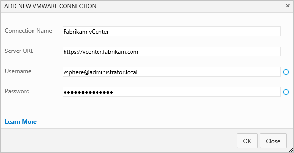
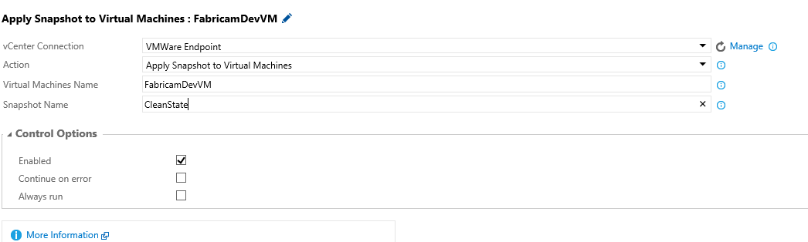

**VMWare Integration**

Connect to a VMWare vCenter server, and easily provision VMs, and perform actions on them like snapshot, revert snapshot, start, stop, delete etc. In this release, the action for reverting to snapshots on virtual machines is available and other actions will be released in the subsequent updates of the extension.

VMware, vCenter Server, and vSphere are registered trademarks or trademarks of VMware, Inc. in the United States and/or other jurisdictions.

**Usage**

The extension installs the following components:

 - A service endpoint for connecting to VMWare vCenter Server.
 - An action that is available in both build and release definitions to manage the VMWare Virtual Machines, like provisioning new VMs, starting/stopping/creating snapshots/reverting snapshots etc.

To manage VMWare VMs, install the vSphere 6.0 Management SDK on the automation agent's machine, and create a service endpoint, and then use the VMWare task in the build/release definition.

**Install vSphere SDK on the Automation Agent's machine**

The extension uses the vSphere SDK to call VMware API functions to access vSphere Web services. Install the SDK on the automation agent's machine:

 1. Install the Java SE Runtime Environment 8. It is recommended to use the latest version that is 8u66 that will install in the folder - C:\Program Files\Java\jre1.8.0\_66. You can obtain the JRE from [here](http://www.oracle.com/technetwork/java/javase/downloads/jre8-downloads-2133155.html).
 2. Create a directory for the vSphere Web Services SDK package, like C:\vSphereSDK. Do not use spaces in the directory names, to avoid issues with some of the included SDK batch and script files.
 3. Download the [vSphere 6.0 Management SDK](https://my.vmware.com/web/vmware/details?downloadGroup=MNGMTSDK600&productId=491) from VMWare website. Login with existing credentials or register on the website to download the SDK.
 4. Unpack the components into subdirectories created in step 2 above. The SDK zip file unpacks into the directory you specify.
 5. Add the precompiled vmware java sdk jar file (vim25.jar) to your system CLASSPATH environment variable. If you had used the folder created above, then the CLASSPATH value will be - C:\vSphereSDK\SDK\vsphere-ws\java\JAXWS\lib\vim25.jar.
 

 6. Ensure that the JAVAHOME environment variable is set to the root path of the Java Runtime Environment (JRE) that is - C:\Program Files\Java\jre1.8.0\_66.

**Create a VMWare vCenter service endpoint**

The extension uses the vSphere SDK to call VMware API functions to access vSphere Web services. Install the SDK on the automation agent's machine:

   1. Open the Services page in your Visual Studio Team Services Control Panel.
 
   2. In the New Service Endpoint list, choose VMWare vCenter.

 

   3. Enter the vCenter URL, and the username and password to access the vCenter, to create the service endpoint.

 

**Using VMWare Resource Deployment task**

 1. Open your build or release definition and add the VMWare Resource Deployment task. The task can be found in the Deploy section of the Add Tasks dialog.
 2. Enter the required parameter values for the VMWare Resource Deployment task.
 3. VMWare Service Connection: Select the VMWare service connection defined above from the drop down.
 4. Action: Select - Revert Snapshot on Virtual Machines - from the drop down.
 5. Virtual Machines Name: Provide the name of the VM or a comma separated list of the VMs, like VM1, VM2, VM2.
 6. Snapshot Name: Enter the name of the snapshot that will be applied to the VMs. Note that the snapshot should exist for the VM, else the task will error out.

 
